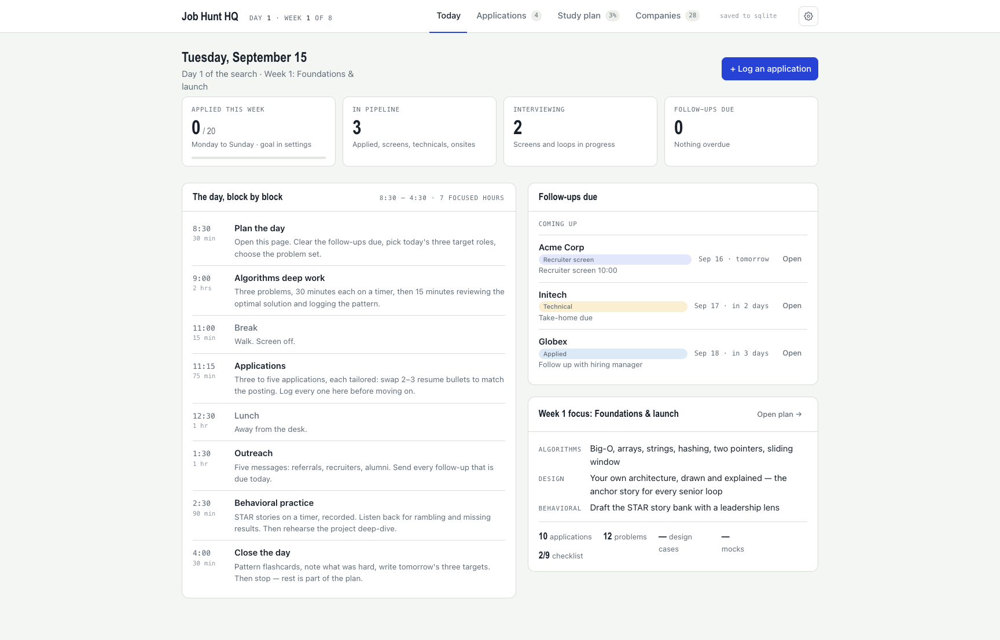

# Job Hunt HQ

A job-search command center you run on your own machine. Free and open source (MIT). One small Go binary serves a single page and keeps everything in a SQLite file you own. No accounts, no cloud, no npm, no cgo.

I built it for my own search and I'm sharing it so you can run yours. If it helps, tell a friend who's looking.



## What you get

Four tabs on one page:

- **Today** — day and week counter for your search, weekly stats (applied vs. goal, pipeline, interviewing, follow-ups due), the day block by block, and this week's study focus. Both the schedule and the focus have an **Edit** button: rewrite them in plain text, and Reset brings the track's version back.
- **Applications** — the tracker. Each application moves through `saved → applied → screen → technical → onsite → offer` (or `rejected` / `withdrawn`). Every status change is logged, so you can see which sources actually convert. Each row also shows the job's posting date and how long ago that was (filled in for you when you save from the board search), so a fresh posting stands out from a stale one.
- **Study plan** — an 8-week checklist in two tracks: **General** (any role: resume, story bank, applications, outreach, interview practice, negotiation) and **Software engineering** (adds algorithms, system design, and coding mocks). Pick yours in settings. Progress is saved per item. Each track is one JSON file in `tracks/`, so a track for your field is a small contribution (see below).
- **Companies** — 179 employers to start from, each with a live job board that lists every open role, in every function, and a search box that queries all of them at once and saves what you like into the tracker. See below.

Everything is stored locally. Export a JSON backup any time and import it on another machine.

## Download

Grab the file for your machine from the [releases page](https://github.com/rembrandtreyes/jobhunt-hq/releases/latest), unzip it, and run `hq`. It opens on http://127.0.0.1:8787 and creates `hq.db` next to itself. No Go, no install.

| you have | file | first run |
|---|---|---|
| Mac with Apple silicon (M1 and later) | `hq_…_darwin_arm64.tar.gz` | `xattr -d com.apple.quarantine ./hq && ./hq` — macOS blocks unsigned downloads once; this clears the flag. Or right-click `hq` → Open. |
| Mac with an Intel chip | `hq_…_darwin_amd64.tar.gz` | same as above |
| Windows | `hq_…_windows_amd64.zip` | double-click `hq.exe`; if SmartScreen appears, More info → Run anyway |
| Linux | `hq_…_linux_amd64.tar.gz` (or `arm64`) | `./hq` |

Or skip the browser and the quarantine flag entirely with one line in a terminal (macOS, Apple silicon shown; swap `darwin_arm64` for `darwin_amd64`, `linux_amd64`, or `linux_arm64`):

```sh
mkdir -p ~/jobhunt && cd ~/jobhunt
curl -L https://github.com/rembrandtreyes/jobhunt-hq/releases/latest/download/hq_darwin_arm64.tar.gz | tar xz
./hq
```

Have Go installed? `go install github.com/rembrandtreyes/jobhunt-hq@latest` builds it locally as `jobhunt-hq` in your Go bin directory, with no download warnings at all.

Keep `hq` and `hq.db` together, wherever you like. To upgrade, replace `hq`; the database stays.

## Quick start from source

Requires [Go](https://go.dev/dl/) 1.24 or newer.

```sh
git clone https://github.com/rembrandtreyes/jobhunt-hq
cd jobhunt-hq
go run .          # → http://127.0.0.1:8787   (creates hq.db in the current directory)
```

Open the page, click the gear icon, set your **start date**, **weekly goal**, and **study track** (General or Software engineering). That's the whole setup.

To keep a binary around:

```sh
go build -o hq .
./hq -db ~/jobhunt/hq.db -addr 127.0.0.1:8787
```

| flag | default | meaning |
|---|---|---|
| `-db` | `hq.db` | path to the SQLite database file (created on first run) |
| `-addr` | `127.0.0.1:8787` | listen address |

The server has **no authentication** and is meant for one person on one machine. Keep it on localhost.

## Make it yours

The track gives you a default day and a default week focus. Both are editable from the Today tab, and both come back with one click.

**The day, block by block → Edit.** One block per line, `time | length | title | what to do`, under a heading per day:

```
# Weekdays
8:30 | 30 min | Plan the day | Clear follow-ups, pick today's three target roles
9:00 | 2 hrs | Portfolio work | One piece, start to finish, timer on
11:00 | 15 min | Break
11:15 | 75 min | Applications | Three to five, each tailored, logged here

# Saturday
— | | Light day | One application, then rest
```

`# Weekdays` covers Monday to Friday; `# Monday` … `# Sunday` override a single day. A day you leave out keeps the track's version. The editor opens pre-filled with your current schedule, so you can change one line and save. **Reset to track default** deletes your version.

**Week N focus → Edit.** Rename the row labels and rewrite the lines for any week:

```
# Labels
Pipeline
Story
Practice

# Week 1
Twenty target accounts, with a reason for each
Your 90-second intro, recorded and timed
Six common questions for your role, answered out loud
```

Weeks you leave out keep the track's lines. The Study tab uses the same labels and lines. A focus belongs to the track you wrote it on: switch tracks and you see that track's own focus; switch back and yours is there again. Your schedule is yours on every track.

Both are stored in your database as settings and travel with export/import. Saving without changing anything stores nothing, so an untouched day or week keeps following the track when the track is updated.

**Adding a study track.** A track is one file in `tracks/`, for example `tracks/sales.json`, with the same shape as `tracks/general.json`: `id` (equal to the filename), `label`, `sub`, `weighting`, `rulesTitle`, `rules`, `focusLabels`, `groups`, `resources`, `schedule`, `afternoon`, `weekend`, and `plan` (eight weeks, each with `theme`, `targets`, `focus` lines matching `focusLabels`, and `items` with stable ids). Item ids are progress keys and must be unique across all tracks, so pick a prefix for yours (`s1-accounts`, `s1-intro`, …). `go test ./...` checks all of that and names the problem; `go run .` then shows the track in settings.

## What's seeded on first run

The first run loads `seed.json`: **179 companies whose job boards (Greenhouse, Lever, or Ashby) expose a public feed**. On 2026-09-16 those boards listed **28,373 open roles** across engineering, sales, product, design, data, marketing, customer success, recruiting, finance, and operations, and about 70% of them were outside engineering. It is sample data generated from those feeds, not anyone's application list, and the counts go stale. For each one:

- **Priority** A / B / C is set by how many roles were open on the refresh date (A = 300 or more, B = 75 or more, C = fewer). Re-rank them for yourself; it's your list.
- **Why** and **Signal** summarize that day's board: total open roles, the biggest functions, how many remote, the most-listed US or remote location.
- **Careers link** opens the board. The hidden `sourceUrl` on each row is the board's JSON feed, which is what the job search below reads.

Seeding never overwrites rows that already exist. To start from your own list, edit `seed.json` before the first run, or delete `hq.db` and run again. The Companies tab lets you add, edit, and delete freely.

**Keeping the seed current.** The counts are regenerated from the live boards by `go run ./cmd/seedgen` (standard library only): it refetches every company's feed and rewrites priority, location, why, and signal, never dropping a company (a feed that fails keeps its old row, and nothing is written if more than 20% fail). A GitHub Actions workflow runs it every Monday and commits `seed.json` when the numbers changed. To add a company whose board is on Greenhouse, Lever, or Ashby: `go run ./cmd/seedgen -add greenhouse:acme="Acme Corp"` (use `lever:` or `ashby:` for those hosts); it fetches the feed first and refuses if the board is dead or already listed. `-report` prints today's counts without writing, `-check` exits 1 if any feed is dead. Seeding only runs on an empty database, so if you already have one, add new companies from the Companies tab or import a newer `seed.json`.

## Find jobs

**In the page.** The Companies tab has **Search the boards**: type role words (`customer success manager`, `backend engineer`, `recruiter`) and, if you like, location words (`remote`, `phoenix`), and every seeded company's live board is searched at once — every function, not just engineering. All the role words must appear in the title; any one location word is enough. Newest postings come first. **Save** puts a posting into your tracker as `saved` with "Apply" due in two days; a posting already in your tracker says so. Results are cached for an hour per board; **refresh** fetches again. Boards are fetched in the background when the server starts, so the first search is quick.

**With Claude Code.** The repo ships a project skill at `.claude/skills/find-jobs/`. With the server running, open Claude Code in the repo and say something like:

> find customer success and account manager roles, remote or Phoenix

or

> find senior backend and devops roles, remote

It reads every company's live feed, filters by your titles and location, skips postings you already have, shows you a table, and saves the ones you pick as `saved` applications with a follow-up date. Any function works; the feeds are the companies' whole boards. Name a company that isn't in your list and it will look for that company's board and offer to add it.

The skill is just a markdown file. If you don't use Claude Code, ignore or delete the `.claude/` directory; nothing else depends on it.

**Without Claude.** Every company's careers link opens its board. Each row's feed URL is also plain JSON you can read from a terminal; for a Greenhouse board:

```sh
curl -s https://boards-api.greenhouse.io/v1/boards/grafanalabs/jobs \
  | python3 -c 'import json,sys; [print(j["title"], "—", j["location"]["name"], "—", j["absolute_url"]) for j in json.load(sys.stdin)["jobs"] if "manager" in j["title"].lower()]'
```

Lever feeds are `https://api.lever.co/v0/postings/<slug>?mode=json` (fields `text`, `categories.location`, `hostedUrl`) and Ashby feeds are `https://api.ashbyhq.com/posting-api/job-board/<slug>` (fields `title`, `location`, `jobUrl`).

## Every morning

1. Open the Today tab. Clear the follow-ups that are due.
2. Log every application the moment you send it: **+ Log an application**, set the status, and always fill **next action** and **next date**. That's what the Today tab surfaces later.
3. When something moves (screen booked, rejection, offer), change the status. The history is kept automatically.
4. Tick off the study plan as you go. The week's focus is on the Today tab.

## Your data

`hq.db` is an ordinary SQLite database (WAL mode). Open it with anything:

```sh
sqlite3 hq.db
```

| table | what |
|---|---|
| `applications` | one row per job; `status` is one of saved, applied, screen, technical, onsite, offer, rejected, withdrawn |
| `application_events` | append-only log of every status change (`application_id`, `status`, `at`) — written automatically |
| `companies` | the target list, priority A/B/C |
| `study_progress` | one row per checked study-plan item (`item_id`, `done_at`) |
| `settings` | key/value: `startDate`, `weeklyGoal` |

Queries you will actually want:

```sql
-- pipeline right now
SELECT status, COUNT(*) FROM applications GROUP BY status;

-- which sources convert to a recruiter screen or better
SELECT a.source,
       COUNT(*)                                   AS applied,
       SUM(EXISTS (SELECT 1 FROM application_events e
                   WHERE e.application_id = a.id
                     AND e.status IN ('screen','technical','onsite','offer'))) AS reached_screen
FROM applications a
WHERE a.status <> 'saved'
GROUP BY a.source ORDER BY reached_screen DESC;

-- days from application to first screen
SELECT a.company, a.role,
       julianday(MIN(e.at)) - julianday(a.applied_at) AS days_to_screen
FROM applications a JOIN application_events e ON e.application_id = a.id
WHERE e.status = 'screen' AND a.applied_at <> ''
GROUP BY a.id ORDER BY days_to_screen;

-- follow-ups due
SELECT company, role, next_date, next_action FROM applications
WHERE next_date <> '' AND next_date <= date('now') AND status NOT IN ('rejected','withdrawn')
ORDER BY next_date;
```

### Backup, and moving between machines

`cp hq.db hq-$(date +%F).db` while the server is stopped, or `curl -o backup.json localhost:8787/api/export` any time. To load a backup into another install:

```sh
curl -X POST localhost:8787/api/import -H 'Content-Type: application/json' --data-binary @backup.json
```

Import merges: it adds and updates, never deletes.

## API

All JSON. The page is the only client, but nothing stops a script from using it.

| method | path | body |
|---|---|---|
| GET | `/api/state` | — → `{apps, companies, done, settings}` |
| GET | `/api/tracks` | — → the study tracks keyed by id, straight from `tracks/*.json` |
| GET | `/api/openings?q=&loc=&refresh=1` | — → `{openings, boards, failed, cachedAt, truncated}`; searches every company's board feed (cached an hour), read-only |
| GET | `/api/export` | same as state, served as a download (backup) |
| POST | `/api/import` | the export shape; upserts apps and companies, adds study items, applies settings |
| PUT | `/api/applications/{id}` | application object (see `Application` in `main.go`); upsert |
| DELETE | `/api/applications/{id}` | — (also removes its events) |
| PUT | `/api/companies/{id}` | company object; upsert |
| DELETE | `/api/companies/{id}` | — |
| PUT | `/api/study` | `{"done": {"w1-resume": true, ...}}` — replaces the full set |
| PUT | `/api/settings` | `{"startDate": "YYYY-MM-DD", "weeklyGoal": 20, "track": "general", "schedule": {...}, "focus": {...}}` — `track` is a track id; `schedule` is `{"weekday"\|"mon"…"sun": [{t, d, w, h, c}]}` and `focus` is `{"labels": [...], "weeks": {"1": [...]}}`; for those two, `null` clears and leaving the key out keeps what is stored |

Ids are client-generated and match `^[A-Za-z0-9_-]{1,64}$`. Timestamps are server-set RFC3339 UTC; dates you enter are plain `YYYY-MM-DD`.

## How it's built

```
main.go                        HTTP server, SQLite schema, REST API, first-run seeding
tracks.go                      loads and validates tracks/*.json, serves them, injects them into the page
customize.go                   validation for the per-user schedule and focus settings
*_test.go                      httptest suite against a temp-file database, incl. property tests
web/index.html                 the whole UI — inline CSS + vanilla JS, no build step, embedded with go:embed
tracks/*.json                  the study tracks — one file each, compiled into the binary
seed.json                      first-run data (never overwrites existing rows)
cmd/seedgen/main.go            regenerates seed.json from the live boards (refresh, -add, -check, -report)
.claude/skills/find-jobs/      the Claude Code skill that searches the job boards
```

- SQLite via [ncruces/go-sqlite3](https://github.com/ncruces/go-sqlite3) — SQLite compiled to WebAssembly, so the binary is pure Go and cross-compiles anywhere. No cgo.
- Real columns rather than JSON blobs, so the database stays hand-queryable.
- One connection, WAL mode, `busy_timeout` set. Plenty for one person.

## Development

```sh
go test ./...                    # run the test suite
go vet ./... && gofmt -l .       # both must be clean before committing
go build -o hq .                 # rebuild after editing web/index.html
```

CI (`.github/workflows/ci.yml`) runs `go vet`, `gofmt -l`, `go build`, and `go test` on every push and pull request, using the Go version from `go.mod`.

`hq.db*` is gitignored. Never commit a database.

## Contributing

Issues and pull requests are welcome. Good first contributions: more companies with public board feeds in `seed.json` (add them with `go run ./cmd/seedgen -add …` so the row is generated from the live feed), a study track for a specific field (sales, design, data, recruiting — one file in `tracks/`, see "Adding a study track" above), and fixes to the page. Keep the spirit of the tool: single binary, single page, local first, no dependencies beyond the standard library and the SQLite driver.

## License

[MIT](LICENSE). Use it, fork it, share it.
